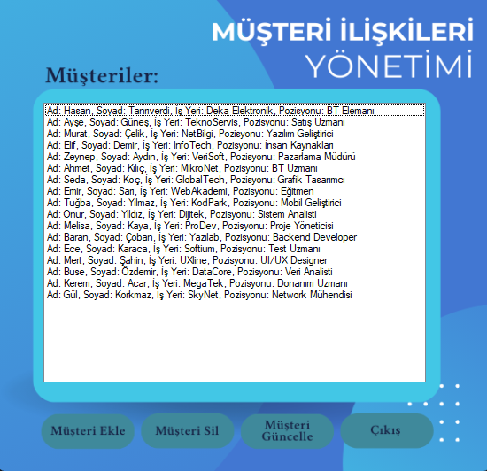

# 💼 Müşteri İlişkileri Yönetimi

Bu proje, **C# Windows Forms** kullanılarak geliştirilmiş bir **Müşteri İlişkileri Yönetimi** uygulamasıdır. Kullanıcılar, müşterileri ekleyebilir, silebilir, güncelleyebilir ve müşteri bilgilerini yönetebilir. Proje eğitim amaçlıdır.

## 🧩 Özellikler

- Müşteri ekleme, silme ve güncelleme
- Müşteri bilgilerini görüntüleme
- Kullanıcı dostu arayüz

## 🛠️ Kullanılan Teknolojiler

- C# (Windows Forms)
- .NET Framework
- Visual Studio
- (Opsiyonel: JSON, XML ya da SQL Server ile veri saklama)

## 🖼️ Uygulama İçi Ekran Görüntüleri

